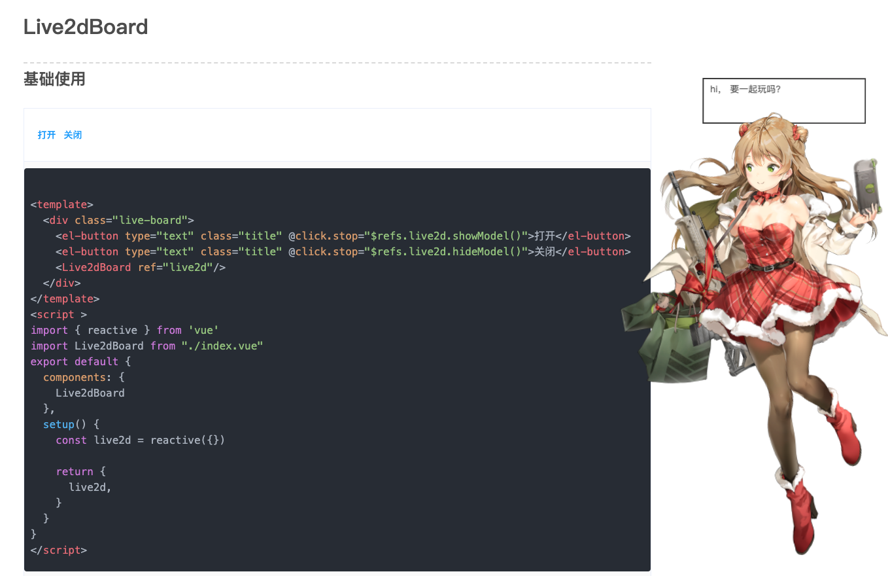

# 2v-start-kit 🍌

## 基本介绍

2v-start-kit 使用 `vite2.0` + `vue3.0` 组成的web应用前端模板。

🌤🌤🌤 此方案正自用中，使用了beta版依赖，仅供学习参考。

## 在线预览

<p align="center">
  
</p>

[2v.design](https://www.2v.design) 基于此模板开发，考虑以后收集一些有趣的东西。

### 核心依赖如下

- 基础构建 `vite 2.0`
- 前端框架 `vue 3.0`
- UI库 `element-plus beta`
- 状态管理 `pinia` （与下一代`vuex`类似，等vuex更新后会切换）
- 路由管理 `vue-router`
- 样式处理 `sass`

## 功能

- [x] 📝 支持代码风格规范检查/提示/修正

- [x] 📝 支持提交风格规范检查/提示 (默认关闭)

- [x] 👌 集成基于简单的登录跳转Demo

- [x] 👌 支持组件 README.md文件渲染 src/components/xxx

- [x] 👌 集成SCP命令 方便部署

- [x] 👌 顺手送几个大漂亮

## 开发

### Node版本 >= 13

```bash
yarn   && yarn dev

yarn husky #开启提交检查

```

### 配置env

```bash
根目录/
    .env     #配置 IP
    env.js   #配置 请求相关
```

### 编译 & 部署

```bash
yarn build

# 配置好目标服务器路径
# 根目录/scripts/scp.js
const servers = {
  1: '账号:密码@IP地址1: /目标路径/dist/'
  2: '账号:密码@IP地址2: /目标路径/dist/'
}

yarn scp 1   #推送到 IP地址1
yarn scp 2   #推送到 IP地址2

```

## 风格规范

### 代码风格规范

- 使用 `eslint` + `prettier` + `eslint-vue`
- 尽量遵循vue官方推荐风格

```bash
# 配置文件路径

根目录/
    .prettierrc
    .eslintrc.js
```

### 样式风格

- 使用 `stylelint` + `stylelint-scss` + `stylelint-config-prettier`工具

```bash
# 配置文件路径

根目录/
    .stylelintrc.js
```

### 代码提交检测(默认关闭)

- 使用 `husky` + `commitlint` + 自定义脚本

```bash
# 开启提交格式化
yarn husky

# 配置文件路径
根目录/.husky/
    /check-keyword.sh 
    /pre-commit
    /commit-msg
```

## 最后

未来看好vite + vue，应该是一个趋势，此项目不定期更新
